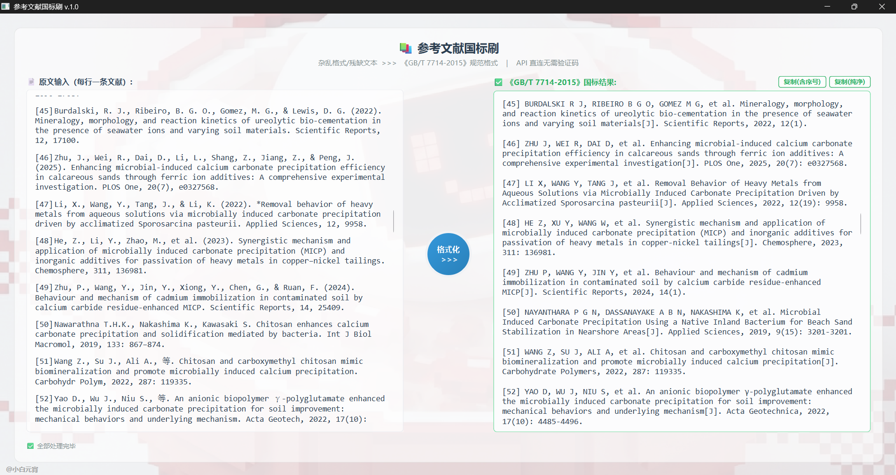

# Ref Brusher

一款面向中文科研写作的桌面参考文献格式化工具。粘贴一批不规范引用后，程序会查询开放学术元数据源、核验候选记录，并输出 GB/T 7714-2015 格式结果。




## 功能

- 批量拆分和清洗原始参考文献文本。
- 依次查询 OpenAlex、Crossref、Semantic Scholar、DBLP 等元数据源。
- 针对中文文献提供独立检索与候选核验流程。
- 统一作者名、题名、期刊、年份、卷期和页码。
- 输出 GB/T 7714-2015 格式，并显示处理进度与失败原因。
- 网络查询在后台线程运行，避免桌面界面卡死。

## 快速开始

需要 Python 3.10 或更高版本。

```powershell
git clone https://github.com/chidou59/ref-brusher.git
cd ref-brusher
python -m venv .venv
.\.venv\Scripts\Activate.ps1
python -m pip install -r requirements.txt
python main.py
```

多数数据源不需要密钥。可选配置请通过环境变量提供，变量清单见 `.env.example`；不要把真实密钥写入源码或提交到 Git。

## 工作原理

```text
原始引用 -> 文本拆分 -> 多源检索 -> 候选核验 -> 字段标准化 -> GB/T 7714 输出
```

详细模块边界见 [`docs/ARCHITECTURE.md`](docs/ARCHITECTURE.md)。

## 项目结构

```text
ref-brusher/
├─ main.py                  PySide6 入口与控制器
├─ views/                   主窗口
├─ ui_framework/            可复用 UI 基础组件
├─ workers/                 后台查询线程
├─ services/                流程编排与格式化
│  └─ api_engines/          学术数据源适配器
├─ core/                    结果核验
├─ logic/                   中文文献检索
├─ models/                  引用数据模型
└─ docs/ARCHITECTURE.md      架构说明
```

## 使用边界

元数据由第三方服务提供，可能存在缺失、错误、限流或临时不可用。正式投稿前请对照 DOI、原文和目标期刊要求人工复核。访问网页型数据源时请遵守其服务条款和访问频率限制。

## 参与贡献

欢迎提交可复现的 Issue 或 Pull Request。报告格式错误时，请提供脱敏后的输入、预期输出、实际输出及来源 DOI/URL。

## 许可证

本项目采用 [MIT License](LICENSE)。
